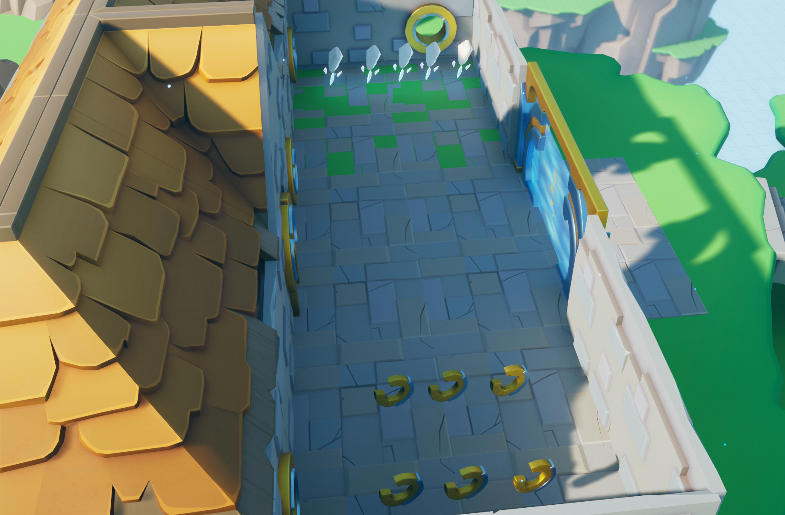

# CS415_MP2_levelDesign

## Enemies

There are a total of three types of enemies: the Pursuer, mortar, and the turret.

### Pursuer

The pursuer enemy type will either roam around the area with random destinations, or patrol between two set locations. When the player is in its sight radius, it will go into the chase state, where it will chase the player and cause damage, disable input temporally, and knockback upon collision. Crouching or breaking its line of sight will cause it to go back to the roam or patrol state. Jumping onto the head of this enemy will destroy it. Projectiles launched by the mortar or turret can also destroy it.

### Mortar

The mortar enemy will launch mortar shells in a certain radius randomly. Upon collision with the ground or any other object, it will explode, damaging the player (or destroying the pursuer) in a certain radius, and knocking them back. Player's collision with the mortar itself will not have any effect, unless the player jump onto the mortar, which will destroy it. 

### Turret

The turret enemy will be in idle state when the player is not in attack range, and will be in attack state when the player enters it. The light on the turret reflects its current state. If the player is crouching, the turret will not detect the player. Direct collision with the turret itself have no effect, unless the player jumps on the turret, which will destroy it. The bullet that the turret shoots will damage and knock player back, and destroy pursuer type enemies. 

## Levels

### Level 1 & Level 3

Level 1 and Level 3 are levels that are used for immersion. They are both relatively short. Level 1's enemies are not hostile towards the player, creating a false sense of peace, while Level 3 has an red & black color scene, creating a sense of urgency. 

### Level 2

Level 2 consists of 5 stages, each separated by a checkpoint and a force gate. Since progression is based on score earned, the force gate can stop the player from going back to the previous stage after a retry, since on retry the game respawns all collectibles. The objective on the left side of the screen tells the player what score is needed to enter the next stage.

##### Stage 1: Tutorial

Stage one is a simple yard with 5 score packs and a few health packs. Its purpose is to show what the player needs to do to enter the next stage. 

##### Stage 2: The Plain

Stage 2 is a plain with score packs scattered around and enemies defending them. There are buildings and trees placed so that you can break enemies' line of sight easily. You can destroy most of the enemies, but one mortar is placed on top of a building so that you are never safe in this stage. The turrets are mostly placed at the edge of the map so that the knockback effect can push you off the map, making this stage more challenging. 

##### Stage 3: The Maze

Stage 3 is a maze. To make the exploration of this maze less tedious, all the score packs give off light so they can be more easily located. The windows on the walls can also give the player a direction of where to go next. The pursuer is the only enemy in this stage.

##### Stage 4: Parkour

 

Stage 4 is a parkour stage with no enemies. To make this stage more challenging, once the player start, the original third person camera will be replaced by a fixed location camera, making it hard to navigate. 

##### Stage 5: The Town

Stage 5 is a town area that have a similar playstyle with stage 2.
